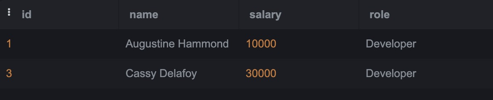
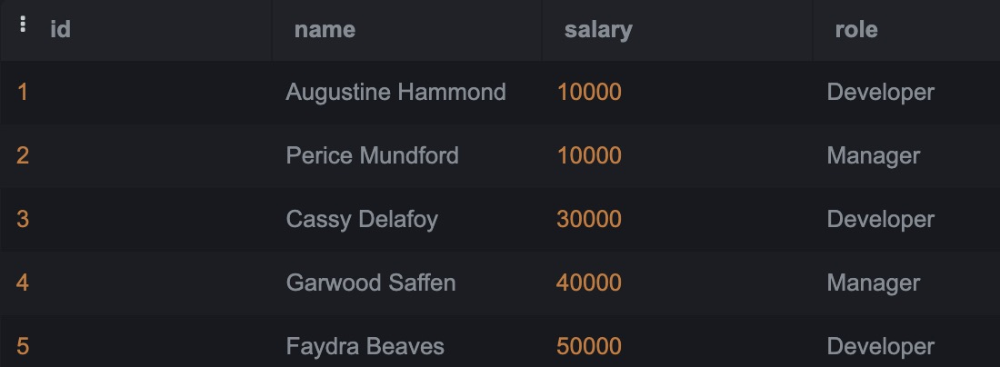
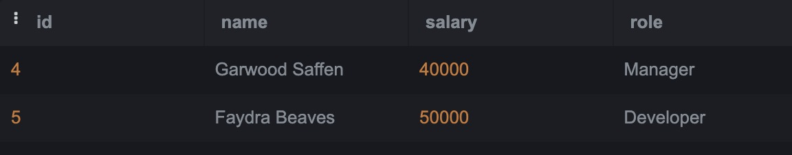

# SQL-Lab2

# We will use the Employees and Awards table below:

 

### Q1: Choose all employees who have received an award (Nested Query)?
Query:
```sql

select * 
from employee
where ( select employee_id from awards where awards.employee_id = employee.id) 
```
Output:

 

### Q2: Choose all employees who have never received an award (Nested Query)?
Query:
```sql
select * 
from employee
where ( select employee_id from awards where  awards.employee_id != employee.id)
```
Output:


 
### Q3: Choose all Developers who make more than all Managers combined (Nested Query)?
Query:
```sql
select *
from employee
where employee.role == "Developer" and 
employee.salary >= (
  SELECT sum(salary) 
  from employee 
  where employee.role == "Manager")
```
Output:
when using ">" the developer with the highest salary is equal to both managers, so I added "=" to show him as well 


 
### Q4: Choose all Developers who make more money than any Manager (Nested Query)?
Query:
```sql

select *
from employee
where employee.role == "Developer" and 
employee.salary > (
  SELECT min(salary) 
  from employee 
  where employee.role == "Manager")
```
Output:


 
### Q5: Choose all employees whose salaries are higher than the average for their position. (Nested Query)?
Query:
```sql
select *
from employee
where 
employee.salary > (
  SELECT avg(salary) 
  from employee 
  group by role)
```
Output:


